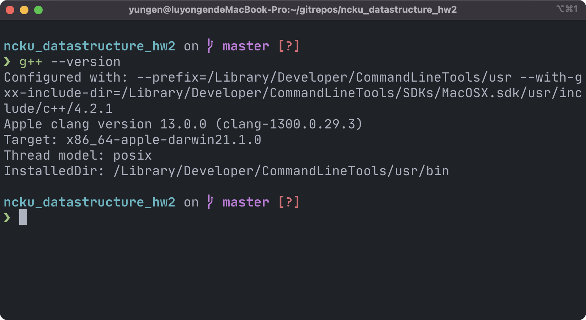
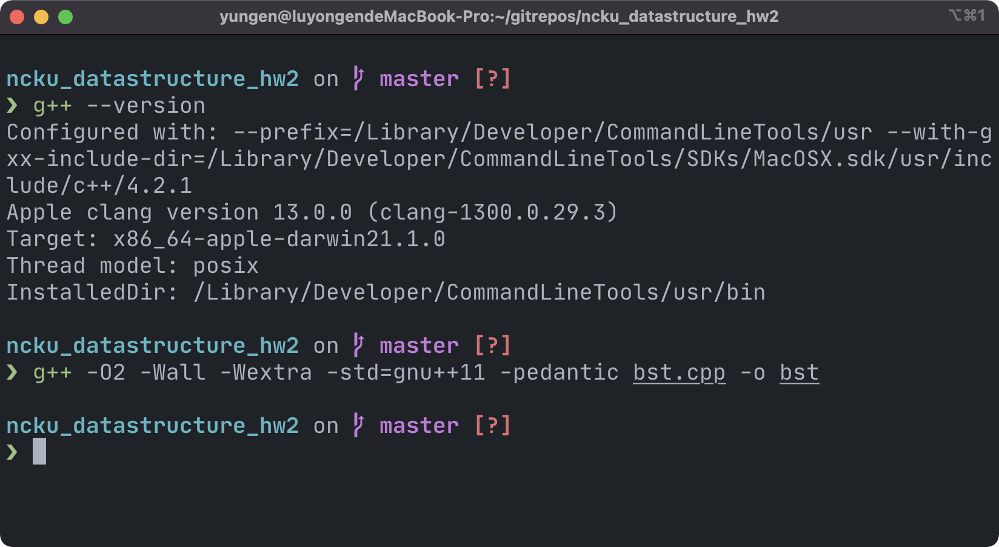

## DataStructure_HW2

#### 執行環境：

* 電腦：MacBook Pro 15-inch, 2017
* 作業系統：macOS Monterey 12.0.1
* CPU: i7-7700HQ
* RAM: 16GB

#### 程式編譯環境：

* 使用程式語言：C++

在 terminal 中使用g++

編譯 argument 為 g++ -O2 -Wall -Wextra -std=gnu++11 -pedantic rat.cpp -o rat

#### delete node 的方法

在 delete node 時，主要會有五種情況

1. 遇到nullptr：直接 return nullptr
2. 遇到 left node 跟 right node 都為 nullptr ：直接刪除該節點，並 return nullptr
3. 遇到 left node 為 nullptr，right node 為有值：刪除該節點，並 return right node 為新的 node root
4. 遇到 right node 為 nullptr，left node 為有值：刪除該節點，並 return left node 為新的 node root
5. 遇到 left、right node 皆有值：將右子樹的最小 node 與 被刪除 node 的位址互換，並刪除目標 node

在發生第五種情況時，有以下幾點可能

1. 最小 node 為右子樹的 leaf：將最小 node 的位址取代被刪除 node 位址並刪除 node
2. 最小 node 有右子樹且最小 node 的 parent 不是被刪除 node：將最小 node 的位址取代被刪除 node 位址，並將最小 node 的右子樹連接到原本最小 node 的 parent
3. 最小 node 有右子樹且最小 node 的 parent 是被刪除 node（最小 node 為右子樹 root）：將最小 node 的位址取代被刪除 node 位址並刪除 node
